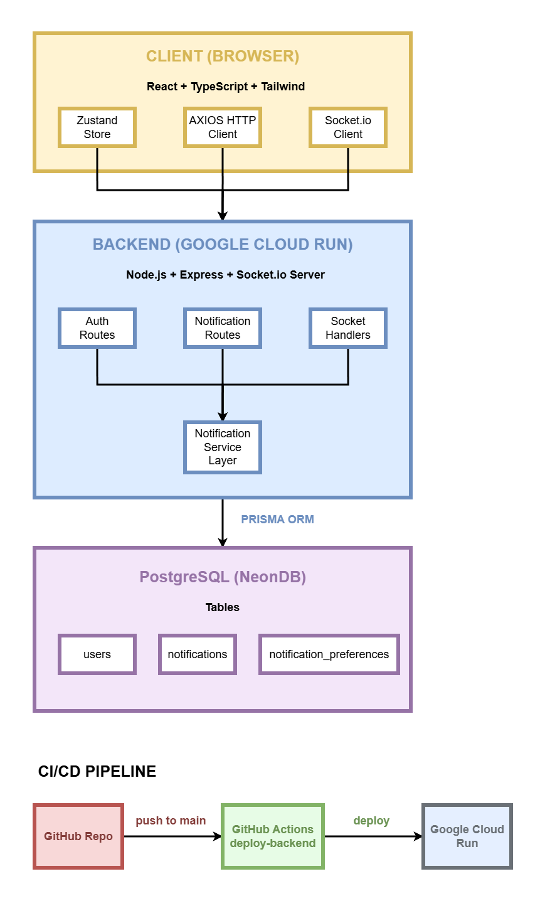
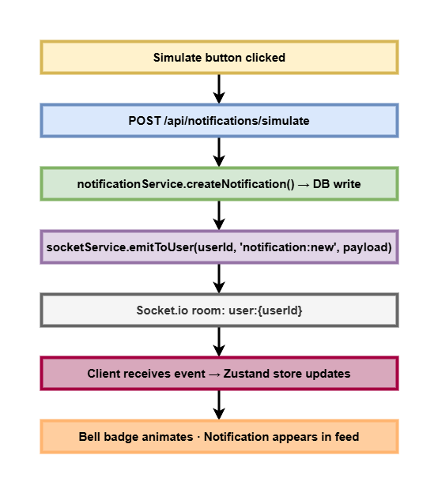

# Stackly — Real-Time Notification Center

A production-deployed, full-stack real-time notification system built on top of a fake SaaS platform. This project demonstrates WebSocket architecture, JWT-secured socket connections, per-user notification rooms, token rotation, and a fully responsive React frontend — all deployed and live.

**Live site:** [stackly.vercel.app](https://stackly-real-time-notification-syst.vercel.app/login)  
**API health:** [stackly-backend-334263295854.us-central1.run.app/health](https://stackly-backend-334263295854.us-central1.run.app/health)  
**Repo:** [github.com/YOUR_USERNAME/stackly-notification-center](https://github.com/AhmedIsmailKhalid/Stackly-Real-Time-Notification-System)

---

## The Problem

Every production SaaS product has a notification system. Most engineers have never built one from scratch — they reach for Firebase, Pusher, or a managed WebSocket service and never touch the real-time layer directly. The result is a generation of frontend developers who can wire up a third-party SDK but can't explain what happens when a socket disconnects, how to authenticate a WebSocket handshake, or how to guarantee a notification reaches only the right user.

This project is the from-scratch alternative: a real-time notification center built without managed WebSocket services, with every layer owned — connection lifecycle, JWT auth on the socket handshake, per-user rooms, token rotation, preference persistence, and a live demo simulator so reviewers can see it working in real time.

---

## What It Does

**For users:**
- Receive real-time notifications instantly without page refresh
- Five notification types: Mentions, Comments, Team Activity, System Alerts, Assignments
- Bell icon with animated unread badge that updates in real time
- Dropdown feed showing the 10 most recent notifications
- Full notification center with filter tabs, date grouping, and pagination
- Mark single or all notifications as read
- Per-type notification preferences (in-app and email toggles)
- Session persistence via httpOnly refresh token cookie

**For portfolio reviewers:**
- Live notification simulator on the dashboard — trigger any notification type and watch it appear instantly across open tabs
- Realistic randomized notification content — no two simulations produce the same message
- Demo credentials pre-filled on the login page — one click to get in

---

## Technical Highlights

**WebSocket authentication at the handshake level** — Socket.io middleware verifies the JWT before the connection is established. Unauthenticated clients are rejected before they join any room, not after. This mirrors how production systems handle socket security rather than relying on application-level checks after the fact.

**Per-user socket rooms** — each authenticated user joins a private room keyed by their userId (`user:{id}`). Notifications are emitted only to the target user's room, not broadcast to all connected clients. This is the correct pattern for multi-tenant SaaS notification delivery.

**Opaque refresh token rotation** — refresh tokens are random hex strings, not JWTs. They're hashed with SHA-256 before storage — the DB never holds a raw token. On each refresh, the old token is revoked and a new one is issued. Token reuse triggers a full revocation of all sessions for that user.

**Zustand + socket state sync** — socket events update Zustand store directly without triggering API calls for every event. The unread count is periodically reconciled against the DB to prevent drift from rapid or out-of-order socket events.

**Preference-aware delivery** — before creating a notification, the service checks the recipient's preferences for that notification type. If in-app delivery is disabled, the notification is not created and not emitted. Preferences are enforced at the service layer, not the UI layer.

**Connection pooling on Neon** — the backend uses Neon's pooled connection string with explicit `connection_limit` and `pool_timeout` parameters to prevent connection exhaustion under rapid notification load.

---

## Architecture


**Real-time flow:**


---

## Running Locally

**Prerequisites:** Node.js 20+, a Neon account
```bash
# Backend setup
cd backend
npm install
cp .env.example .env
# Fill in DATABASE_URL (Neon pooled connection string)
# Generate JWT secrets:
# node -e "console.log(require('crypto').randomBytes(64).toString('hex'))"

npm run db:migrate:dev  # Creates tables
npm run db:seed         # Seeds demo users and notifications
npm run dev             # Starts on http://localhost:8080

# Frontend setup (new terminal)
cd frontend
npm install
cp .env.example .env
# VITE_API_URL=http://localhost:8080
# VITE_SOCKET_URL=http://localhost:8080
npm run dev             # Starts on http://localhost:5173
```

**Demo credentials:**
```
email:    demo@stackly.dev
password: demo1234
```

---

## Deployment

| Service  | Platform            | URL |
|----------|---------------------|-----|
| Frontend | Vercel              | stackly.vercel.app |
| Backend  | Google Cloud Run    | stackly-backend-334263295854.us-central1.run.app |
| Database | Neon PostgreSQL     | Hosted PostgreSQL with connection pooling |
| CI/CD    | GitHub Actions      | Auto-deploy on push to main |

> **Note:** The backend runs on Google Cloud Run and scales to zero between requests. The first request after a period of inactivity may take 10–30 seconds to cold start. Visit the [health endpoint](https://stackly-backend-334263295854.us-central1.run.app/health) to wake it up before using the app.

---

## Technology Stack

| Layer              | Technology              |
|--------------------|-------------------------|
| Frontend           | React 18 + TypeScript   |
| Styling            | Tailwind CSS            |
| State Management   | Zustand                 |
| Real-Time (client) | Socket.io client        |
| HTTP Client        | Axios                   |
| Backend            | Node.js + Express       |
| Real-Time (server) | Socket.io server        |
| ORM                | Prisma                  |
| Database           | PostgreSQL (Neon)       |
| Auth               | JWT + opaque refresh tokens |
| Frontend Hosting   | Vercel                  |
| Backend Hosting    | Google Cloud Run        |
| CI/CD              | GitHub Actions          |